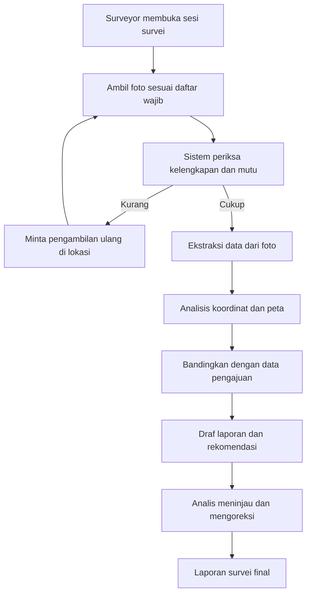
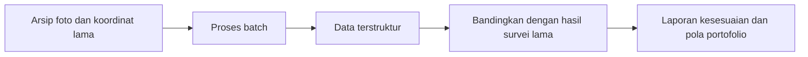
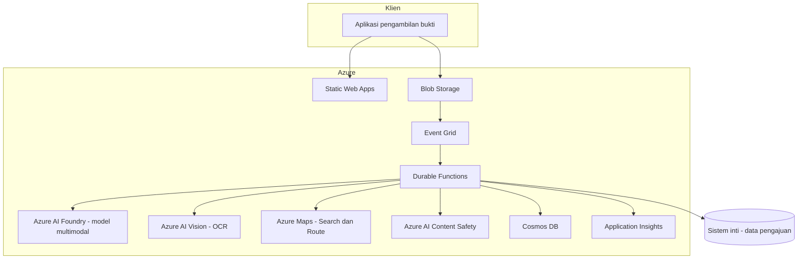

# PRD — Asisten Review Bukti Survei Rumah

| | |
|---|---|
| **Versi** | 0.2 (draf untuk review) |
| **Tanggal** | 23 September 2026 |
| **Status** | Belum disetujui |
| **Tahap berjalan** | **Demo manual** — tanpa aplikasi dan tanpa infrastruktur. Lihat [§5.3](#53-lingkup-tahap-sekarang--demo-manual) |
| **Pemilik produk** | _(diisi)_ |
| **Domain** | Perusahaan pembiayaan — survei rumah calon debitur dan agunan |

---

## 1. Ringkasan Eksekutif

Sistem ini membantu petugas meninjau bukti survei rumah. Bukti berupa **foto** dan **titik koordinat** diproses menjadi **data terstruktur**, dibandingkan dengan **data pengajuan**, lalu disajikan sebagai **draf laporan dan rekomendasi tindak lanjut**.

Sistem **tidak** menentukan nilai properti dan **tidak** mengambil keputusan kredit. Keputusan tetap pada manusia.

Nilai utamanya ada pada tiga hal:

1. Mengurangi kunjungan ulang karena bukti tidak lengkap.
2. Menyeragamkan isi laporan survei antarpetugas dan antarwilayah.
3. Mengarahkan perhatian analis ke berkas yang perlu diperiksa lebih teliti.

---

## 2. Latar Belakang dan Masalah

Setiap pengajuan yang memerlukan survei rumah menimbulkan biaya kunjungan, waktu tunggu, dan pekerjaan administrasi. Masalah yang berulang:

| Masalah | Akibat |
|---|---|
| Bukti foto kurang lengkap atau tidak terbaca | Kunjungan ulang, pengajuan tertunda |
| Isian laporan tidak seragam antarpetugas | Sulit dibandingkan dan dianalisis |
| Analis membaca seluruh berkas dengan bobot sama | Waktu habis di berkas yang sebenarnya wajar |
| Arsip foto survei lama tidak pernah dapat ditelusuri | Tidak ada pembelajaran dari data yang sudah dimiliki |

### 2.1 Batas Pengetahuan yang Diakui

PRD ini disusun dari pemahaman umum mengenai survei kredit di Indonesia, **bukan dari formulir survei yang berlaku di perusahaan**. Bagian [§18 Pertanyaan Terbuka](#18-pertanyaan-terbuka) mencantumkan hal yang wajib dikonfirmasi sebelum pembangunan dimulai.

Tidak ditemukan contoh terverifikasi perusahaan pembiayaan di Indonesia yang telah menerapkan hal serupa. Rujukan pola berasal dari luar negeri dan bersifat analogi, bukan bukti penerapan lokal.

---

## 3. Tujuan dan Non-Tujuan

### 3.1 Tujuan

| ID | Tujuan |
|---|---|
| G-1 | Menurunkan jumlah kunjungan ulang akibat bukti tidak lengkap |
| G-2 | Menghasilkan data survei terstruktur yang seragam dan dapat ditelusuri |
| G-3 | Mempercepat penyusunan laporan survei oleh petugas |
| G-4 | Menandai ketidakcocokan antara bukti dan data pengajuan |
| G-5 | Memungkinkan pengolahan arsip survei lama untuk analisis portofolio |

### 3.2 Non-Tujuan

| ID | Non-tujuan | Alasan |
|---|---|---|
| NG-1 | Menentukan nilai appraisal | Perlu penilai, data pasar, dan aspek legal |
| NG-2 | Menyetujui atau menolak pengajuan | Wewenang manusia |
| NG-3 | Menilai kemampuan membayar | Kondisi rumah bukan ukuran kemampuan bayar |
| NG-4 | Memeriksa dokumen legal, izin, sertifikat, atau NJOP | Dikeluarkan dari lingkup atas keputusan bisnis |
| NG-5 | Memberi tingkat kondisi bangunan (baik/sedang/kurang) | Model belum dapat konsisten |
| NG-6 | Menentukan lebar jalan dalam satuan meter | Tidak andal dari foto maupun peta |
| NG-7 | Menentukan jalan buntu atau posisi tusuk sate | Cakupan peta gang di Indonesia tidak memadai |
| NG-8 | Menggantikan kunjungan surveyor | Kunjungan juga berfungsi sebagai kontrol pencegahan |
| NG-9 | Memproses video penelusuran | Belum menjadi praktik yang berjalan |

> **Catatan penting:** NG-8 adalah batas yang disengaja. Kunjungan fisik bukan sekadar pengumpulan data, melainkan juga penghalang pemalsuan keadaan. Pengurangan kunjungan baru boleh dibahas setelah sistem ini terbukti dan kontrol penggantinya dirancang.

---

## 4. Pengguna

| Persona | Kebutuhan | Interaksi dengan sistem |
|---|---|---|
| **Surveyor lapangan** | Tahu bukti sudah lengkap sebelum meninggalkan lokasi | Mengambil foto lewat aplikasi terpandu, menerima permintaan pengambilan ulang |
| **Analis kredit** | Laporan seragam, perhatian terarah | Meninjau draf laporan, mengoreksi, menyetujui isi laporan |
| **Supervisor cabang** | Mutu bukti antarpetugas terpantau | Melihat ringkasan mutu bukti |
| **Tim risiko** | Pola portofolio dan kejanggalan bukti | Menelusuri hasil pengolahan arsip |
| **Administrator** | Sistem berjalan aman dan terpantau | Mengelola konfigurasi, memantau biaya dan galat |

---

## 5. Ruang Lingkup

### 5.1 Termasuk

- Pengambilan dan unggah foto survei rumah.
- Perekaman titik koordinat beserta akurasinya.
- Pemeriksaan kelengkapan dan mutu bukti.
- Ekstraksi data terstruktur dari foto.
- Analisis lokasi dari koordinat.
- Pembandingan dengan data pengajuan yang sudah terstruktur di sistem inti.
- Draf laporan survei dan rekomendasi tindak lanjut.
- Pengolahan arsip survei lama.

### 5.2 Tidak Termasuk

- Pemrosesan dokumen apa pun.
- Penilaian properti.
- Keputusan kredit.
- Proses video.
- Integrasi ke sistem penagihan atau pemantauan pasca pencairan.

### 5.3 Lingkup Tahap Sekarang — Demo Manual

Dokumen ini menggambarkan sistem utuh, tetapi **yang dikerjakan sekarang hanya demo manual**. Tujuannya membuktikan konsep sebelum ada yang dibangun.

#### Yang dikerjakan saat demo

| Kegiatan | Cara |
|---|---|
| Menyiapkan bukti | Foto diambil sendiri memakai kamera ponsel, 5–8 foto per berkas |
| Menyusun berkas | Folder biasa di komputer, satu folder satu berkas |
| Daftar foto wajib | Ditulis di spreadsheet |
| Koordinat pengambilan | Diketik manual, disalin dari peta atau dibaca dari EXIF foto |
| Alamat pengajuan | Diketik manual, boleh alamat contoh |
| Ekstraksi data dari foto | Playground Azure AI Foundry dengan system prompt baku |
| Analisis lokasi | Pemanggilan sederhana ke Azure Maps |
| Penggabungan hasil | Disalin manual menjadi satu laporan contoh |

Disiapkan 2–3 berkas, dengan **minimal satu berkas sengaja bermasalah**: ada foto wajib yang hilang, alamat tidak cocok, atau foto yang dipakai ulang.

#### Yang ditunda

| Ditunda | Kebutuhan terkait |
|---|---|
| Aplikasi pengambilan bukti | FR-001, FR-005 |
| Pengambilan koordinat otomatis | FR-002, FR-003 |
| Deteksi lokasi tiruan | FR-004 |
| Penyimpanan, basis data, orkestrasi | §11 |
| Managed Identity dan pemberian peran | §12 |
| Penerapan satu perintah | §16 |
| Seluruh kebutuhan non-fungsional | §10 |

#### Alasan

Membangun aplikasi sebelum konsepnya terbukti berisiko membuang usaha. Demo manual sudah cukup untuk menilai apakah hasil ekstraksi masuk akal dan apakah analisis lokasi memberi sinyal yang berarti.

#### Syarat lanjut dari demo

| Syarat | Keterangan |
|---|---|
| Hasil ekstraksi wajar pada sebagian besar foto | Diperiksa manusia, bukan diukur otomatis |
| Model mengaku tidak tahu saat bukti kurang | Diuji dengan foto yang sengaja tidak memadai |
| Analisis lokasi memberi sinyal yang masuk akal | Terutama selisih titik tarikan ke jalan kendaraan |
| Tidak ada keluaran terlarang | Tidak muncul ukuran, nilai, atau rekomendasi kredit |

---

## 6. Alur Pengguna

### 6.1 Alur Utama — Survei Baru



### 6.2 Alur Kedua — Pengolahan Arsip



Alur kedua **tidak menyentuh proses berjalan** dan dipakai sebagai uji kelayakan sebelum alur utama diaktifkan.

---

## 7. Kebutuhan Fungsional

Penomoran dipakai untuk penelusuran ke pengujian.

### 7.1 Pengambilan dan Unggah Bukti

| ID | Kebutuhan | Kriteria diterima | Berlaku sejak |
|---|---|---|---|
| FR-001 | Sistem menyediakan daftar foto wajib yang dapat dikonfigurasi per jenis survei | Daftar dapat diubah tanpa penerapan ulang kode | Fase 2 |
| FR-002 | Sistem menerima unggahan foto beserta metadata waktu dan koordinat | Metadata tersimpan utuh bersama berkas | Fase 2 |
| FR-003 | Sistem merekam radius akurasi koordinat dari perangkat | Nilai akurasi tersimpan dan ditampilkan | Fase 2 |
| FR-004 | Sistem menandai bila perangkat mengindikasikan lokasi tiruan | Penanda tersimpan pada catatan bukti | Fase 3, bergantung Q-11 |
| FR-005 | Unggahan berjalan pada jaringan lambat dan dapat dilanjutkan bila terputus | Unggahan 10 foto berhasil pada koneksi terbatas | Fase 2 |
| FR-006 | Sistem menghitung sidik digital setiap berkas saat diterima | Sidik tersimpan dan tidak berubah | Fase 1 |

Saat demo manual, seluruh baris di atas **tidak berlaku**. Bukti disiapkan dan koordinat diketik sendiri seperti pada §5.3.

#### 7.1.1 Dua Koordinat yang Berbeda Peran

Sistem selalu memerlukan **dua** koordinat, dan nilainya justru ada pada selisih keduanya.

| Koordinat | Asal | Peran |
|---|---|---|
| Titik pengambilan foto | Perangkat surveyor saat memotret | Menunjukkan lokasi foto benar-benar diambil |
| Titik alamat pengajuan | Hasil geocoding alamat pada data pengajuan | Menjadi pembanding |

Satu koordinat saja tidak menghasilkan sinyal apa pun.

#### 7.1.2 Sumber Titik Pengambilan

| Cara | Keandalan | Dipakai pada |
|---|---|---|
| Dibaca aplikasi saat memotret | Tinggi | Fase 2 dan seterusnya, cara yang dituju |
| Dibaca dari sistem survei yang sudah ada | Tinggi | Fase 1, bila arsip sudah merekamnya |
| Dibaca dari EXIF foto | Rendah sampai sedang | Demo saja |
| Diketik manual | Rendah | Demo saja |

EXIF **tidak boleh** dijadikan kontrol keaslian, karena mudah disunting dan kerap terhapus bila foto dikirim lewat aplikasi pesan.

Koordinat wajib diambil **di luar ruangan, di depan rumah**. Akurasi menurun tajam di dalam bangunan.

### 7.2 Pemeriksaan Kelengkapan dan Mutu

| ID | Kebutuhan | Kriteria diterima |
|---|---|---|
| FR-010 | Sistem memeriksa apakah seluruh foto wajib sudah ada | Daftar foto yang belum ada ditampilkan |
| FR-011 | Sistem menandai foto buram, terlalu gelap, atau terlalu terang | Foto uji yang sengaja dibuat buram tertandai |
| FR-012 | Sistem meminta pengambilan ulang selagi sesi masih berlangsung | Permintaan muncul sebelum sesi ditutup |
| FR-013 | Petugas dapat menyatakan alasan bila foto tertentu tidak dapat diambil | Alasan tersimpan sebagai bagian catatan bukti |

### 7.3 Ekstraksi Data dari Foto

Hanya bidang yang sudah disaring sebagai layak. Setiap bidang wajib mendukung nilai `tidak_dapat_dinilai`.

| ID | Bidang | Nilai yang diizinkan | Kriteria diterima |
|---|---|---|---|
| FR-020 | Jumlah lantai | `1`, `2`, `3+`, `tidak_dapat_dinilai` | Sesuai penilaian manusia pada ≥85% foto fasad utuh |
| FR-021 | Jenis bangunan | `permanen`, `semi_permanen`, `tidak_dapat_dinilai` | Sesuai penilaian manusia pada ≥85% kasus |
| FR-022 | Material dinding tampak | daftar tertutup, `tidak_dapat_dinilai` | Sesuai penilaian manusia pada ≥80% kasus |
| FR-023 | Material atap tampak | daftar tertutup, `tidak_dapat_dinilai` | Sesuai penilaian manusia pada ≥80% kasus |
| FR-024 | Tempat parkir mobil atau carport | `ada`, `tidak_ada`, `tidak_dapat_dinilai` | Sesuai penilaian manusia pada ≥85% kasus |
| FR-025 | Jenis permukaan jalan di depan rumah | `aspal`, `beton`, `paving`, `tanah`, `tidak_dapat_dinilai` | Sesuai penilaian manusia pada ≥80% kasus |
| FR-026 | Nomor rumah terbaca | teks atau `tidak_terbaca` | Benar pada ≥90% foto yang nomornya jelas |
| FR-027 | Setiap temuan menyertakan rujukan foto sumber | id foto | Seluruh temuan memiliki rujukan |
| FR-028 | Sistem tidak boleh menghasilkan angka ukuran, nilai properti, atau rekomendasi kredit | — | Tidak ditemukan pada 100% keluaran uji |

### 7.4 Analisis Lokasi

| ID | Kebutuhan | Kriteria diterima |
|---|---|---|
| FR-030 | Sistem melakukan reverse geocoding atas koordinat survei | Alamat hasil tersimpan |
| FR-031 | Sistem membandingkan hasil tersebut dengan alamat pada data pengajuan | Status `cocok`, `cocok_sebagian`, `tidak_cocok` |
| FR-032 | Sistem menghitung jarak dari titik ke jalan utama terdekat | Nilai dalam meter atau `tidak_dapat_ditentukan` |
| FR-033 | Sistem menentukan apakah lokasi terjangkau kendaraan roda empat | `ya`, `tidak`, `tidak_dapat_ditentukan` |
| FR-034 | Sistem mencatat selisih antara koordinat asli dan titik tarikan ke jalan kendaraan | Nilai dalam meter |
| FR-035 | Sistem menandai bila wilayah tidak memiliki data jalan yang memadai | Penanda `cakupan_peta_terbatas` |

> Selisih pada FR-034 adalah penanda utama untuk dugaan lokasi di gang. **Bukan** kesimpulan, melainkan sinyal untuk diperiksa.

### 7.5 Deteksi Bukti Berulang

| ID | Kebutuhan | Kriteria diterima |
|---|---|---|
| FR-040 | Sistem membandingkan sidik gambar dengan arsip pengajuan lain | Skor kemiripan dihasilkan |
| FR-041 | Sistem menandai koordinat yang identik atau sangat berdekatan dengan pengajuan lain | Daftar pengajuan terkait ditampilkan |
| FR-042 | Penandaan disajikan sebagai indikasi untuk diperiksa, bukan sebagai tuduhan | Teks keluaran tidak menyatakan kepastian penipuan |

### 7.6 Rekonsiliasi dan Keluaran

| ID | Kebutuhan | Kriteria diterima |
|---|---|---|
| FR-050 | Sistem membandingkan hasil foto, hasil peta, dan data pengajuan | Daftar ketidakcocokan dihasilkan |
| FR-051 | Sistem menghasilkan draf laporan survei | Draf dapat disunting petugas |
| FR-052 | Sistem menghasilkan rekomendasi tindak lanjut | Salah satu dari `lengkap`, `perlu_bukti_tambahan`, `perlu_kunjungan` |
| FR-053 | Sistem mencantumkan daftar hal yang tidak dapat dinilai | Daftar selalu ada, boleh kosong |
| FR-054 | Keluaran tidak memuat keputusan kredit maupun nilai properti | Terpenuhi pada 100% keluaran uji |

### 7.7 Peninjauan oleh Manusia

| ID | Kebutuhan | Kriteria diterima |
|---|---|---|
| FR-060 | Petugas dapat mengoreksi setiap bidang hasil ekstraksi | Koreksi tersimpan |
| FR-061 | Koreksi tersimpan sebagai data berlabel untuk evaluasi dan pelatihan berikutnya | Tersedia untuk diekspor |
| FR-062 | Laporan final hanya terbit setelah ditinjau manusia | Tidak ada jalur terbit otomatis |
| FR-063 | Seluruh perubahan tercatat beserta pelaku dan waktu | Jejak audit lengkap |

### 7.8 Pengolahan Arsip

| ID | Kebutuhan | Kriteria diterima |
|---|---|---|
| FR-070 | Sistem dapat memproses berkas arsip secara batch | 1.000 berkas selesai tanpa intervensi |
| FR-071 | Hasil arsip dipisahkan dari hasil proses berjalan | Tidak tercampur pada penyimpanan maupun laporan |
| FR-072 | Sistem menghasilkan laporan kesesuaian dengan laporan survei lama | Tingkat kesesuaian per bidang tersaji |

---

## 8. Kontrak Keluaran

Setiap berkas menghasilkan satu catatan berikut.

```json
{
  "caseId": "string",
  "sourceMode": "live | archive",
  "processedAt": "ISO-8601",
  "modelVersion": "string",
  "promptVersion": "string",

  "evidence": {
    "photoCount": 0,
    "photos": [
      { "id": "string", "hash": "string", "capturedAt": "ISO-8601", "qualityFlags": [] }
    ],
    "coordinate": { "lat": 0, "lon": 0, "accuracyMeter": 0, "mockLocationSuspected": false }
  },

  "buildingFindings": {
    "floors": "1 | 2 | 3+ | tidak_dapat_dinilai",
    "buildingType": "permanen | semi_permanen | tidak_dapat_dinilai",
    "wallMaterial": "string | tidak_dapat_dinilai",
    "roofMaterial": "string | tidak_dapat_dinilai",
    "carPark": "ada | tidak_ada | tidak_dapat_dinilai",
    "roadSurface": "aspal | beton | paving | tanah | tidak_dapat_dinilai",
    "houseNumberText": "string | tidak_terbaca",
    "evidenceRefs": { "floors": ["photoId"], "carPark": ["photoId"] }
  },

  "locationFindings": {
    "reverseGeocodedAddress": "string",
    "addressMatch": "cocok | cocok_sebagian | tidak_cocok",
    "distanceToMainRoadMeter": 0,
    "carAccessible": "ya | tidak | tidak_dapat_ditentukan",
    "snapDistanceMeter": 0,
    "mapCoverageLimited": false
  },

  "integrityFlags": {
    "similarPhotoCases": [],
    "similarCoordinateCases": []
  },

  "reconciliation": {
    "conflicts": [
      { "field": "string", "fromEvidence": "string", "fromApplication": "string" }
    ]
  },

  "cannotAssess": ["string"],
  "missingEvidence": ["string"],

  "recommendation": {
    "action": "lengkap | perlu_bukti_tambahan | perlu_kunjungan",
    "reasons": ["string"]
  },

  "draftReport": "string",

  "creditDecision": null,
  "propertyValue": null
}
```

Dua ruas terakhir **selalu bernilai null** dan diuji secara otomatis agar tetap demikian.

---

## 9. Aturan Rekomendasi

Rekomendasi dihasilkan oleh aturan yang dapat dibaca manusia, bukan oleh model. Model hanya mengisi bidang temuan.

| Kondisi | Rekomendasi |
|---|---|
| Ada foto wajib yang belum ada | `perlu_bukti_tambahan` |
| Lebih dari sebagian bidang bernilai `tidak_dapat_dinilai` | `perlu_bukti_tambahan` |
| `addressMatch` bernilai `tidak_cocok` | `perlu_kunjungan` |
| Terdapat penanda kemiripan foto atau koordinat dengan pengajuan lain | `perlu_kunjungan` |
| `mockLocationSuspected` bernilai benar | `perlu_kunjungan` |
| Terdapat ketidakcocokan pada `reconciliation` | `perlu_kunjungan` |
| Seluruh bidang wajib terisi dan tidak ada penanda | `lengkap` |

Ambang dan aturan dapat dikonfigurasi tanpa penerapan ulang kode.

---

## 10. Kebutuhan Non-Fungsional

| ID | Kebutuhan | Target |
|---|---|---|
| NFR-001 | Waktu pemeriksaan kelengkapan saat di lokasi | Di bawah 10 detik per sesi |
| NFR-002 | Waktu pemrosesan lengkap satu berkas | Di bawah 2 menit |
| NFR-003 | Unggahan berhasil pada jaringan seluler lambat | Berhasil pada 3G dengan mekanisme lanjut |
| NFR-004 | Ketersediaan layanan pada jam kerja | 99% |
| NFR-005 | Biaya pemrosesan per berkas | Dipantau dan dilaporkan bulanan |
| NFR-006 | Seluruh keluaran dapat ditelusuri ke foto sumber | 100% |
| NFR-007 | Versi model dan versi prompt tercatat pada setiap hasil | 100% |
| NFR-008 | Sistem tetap berfungsi sebagian bila layanan peta gagal | Hasil foto tetap dihasilkan |

---

## 11. Arsitektur



### 11.1 Pemetaan Layanan

| Kebutuhan | Layanan | Catatan |
|---|---|---|
| Halaman pengambilan bukti | Azure Static Web Apps | Tier gratis memadai untuk awal |
| Penyimpanan media | Azure Blob Storage | Kontainer privat, versioning aktif |
| Pemicu proses | Azure Event Grid | Dipicu saat berkas masuk |
| Orkestrasi dan tunggu bukti tambahan | Azure Durable Functions | Paket Consumption |
| Ekstraksi data dari foto | Azure AI Foundry, model multimodal kelas mini | Gambar diperkecil sebelum dikirim |
| OCR nomor rumah | Azure AI Vision | Hanya pada foto yang relevan |
| Analisis lokasi | Azure Maps Search dan Route | Autentikasi Entra ID |
| Penyaringan unggahan | Azure AI Content Safety | |
| Penyimpanan hasil | Azure Cosmos DB serverless | |
| Pemantauan | Azure Monitor dan Application Insights | Termasuk jejak pemanggilan model |
| Deteksi berkas berulang | Sidik gambar dihitung sendiri | Lebih murah daripada layanan embedding |

### 11.2 Yang Sengaja Tidak Dipakai

| Tidak dipakai | Alasan |
|---|---|
| Azure AI Document Intelligence | Dokumen di luar lingkup |
| Azure AI Video Indexer | Video di luar lingkup |
| API Management | Belum diperlukan, berbiaya tetap |
| Private Endpoint | Ditunda ke tahap produksi |
| Deployment model tipe provisioned | Berbiaya per jam meski menganggur |

---

## 12. Identitas dan Keamanan

### 12.1 Prinsip

**Seluruh koneksi antarlayanan wajib memakai Managed Identity. Tidak ada kunci, connection string, atau shared key di mana pun.**

Alasannya, kebijakan organisasi berpotensi memblokir autentikasi berbasis kunci, dan pendekatan ini menghilangkan kebutuhan menyimpan rahasia.

### 12.2 Jenis Identitas

| Keputusan | Pilihan | Alasan |
|---|---|---|
| Jenis identitas | **User-assigned managed identity** | Dibuat lebih dulu, sehingga peran dapat diberikan sebelum sumber daya lain berdiri, dan tetap sama saat penerapan ulang |
| Identitas per lingkungan | Satu per lingkungan | Memisahkan hak akses antara uji dan produksi |

### 12.3 Peran yang Diperlukan

| Sumber daya tujuan | Peran | Keperluan |
|---|---|---|
| Storage Account | Storage Blob Data Contributor | Membaca dan menulis media |
| Azure AI Foundry / AI Services | Cognitive Services OpenAI User | Memanggil model |
| Azure AI Vision | Cognitive Services User | OCR |
| Azure AI Content Safety | Cognitive Services User | Penyaringan |
| Azure Maps | Azure Maps Data Reader | Search dan Route |
| Cosmos DB | Cosmos DB Built-in Data Contributor | Akses data plane |
| Application Insights | Monitoring Metrics Publisher | Telemetri |

### 12.4 Autentikasi Lokal Dimatikan

| Sumber daya | Pengaturan |
|---|---|
| Storage Account | `allowSharedKeyAccess = false` |
| Cosmos DB | `disableLocalAuth = true` |
| AI Services | `disableLocalAuth = true` |
| Azure Maps | Autentikasi Entra ID, kunci langganan tidak dipakai |
| Key Vault | Mode RBAC; idealnya tidak diperlukan karena tidak ada rahasia |

### 12.5 Catatan Teknis

| Hal | Catatan |
|---|---|
| Kredensial aplikasi | `DefaultAzureCredential` dengan client id identitas, agar tidak salah memilih identitas |
| Azure Maps | Memerlukan header client id akun Maps saat memakai token Entra ID |
| Cosmos DB | Peran data plane diberikan lewat sumber daya `sqlRoleAssignments`, bukan RBAC bidang kontrol biasa |
| Pengembangan lokal | Pengembang masuk lewat `az login`, memperoleh peran yang sama melalui grup Entra ID |
| Penyebaran peran | Pemberian peran bersifat asinkron; penerapan perlu menangani jeda propagasi |

### 12.6 Keamanan Lain

| Kebutuhan | Ketentuan |
|---|---|
| Akses media | Hanya lewat tautan berbatas waktu, tidak ada kontainer publik |
| Keutuhan bukti | Versioning aktif dan berkas tidak ditimpa |
| Jejak audit | Seluruh akses dan perubahan tercatat |
| Data pribadi | Foto rumah dan koordinat diperlakukan sebagai data pribadi |
| Masa simpan | Ditetapkan bersama tim kepatuhan, lihat §18 |

---

## 13. Model dan Prompt

| Aspek | Ketentuan |
|---|---|
| Model | Multimodal kelas mini, dipilih berdasarkan hasil uji, bukan asumsi |
| Keluaran | Wajib mengikuti skema tertutup |
| Nilai tidak yakin | Wajib tersedia opsi `tidak_dapat_dinilai` |
| Larangan | Dilarang menghasilkan ukuran, nilai, sebab kondisi, dan rekomendasi kredit |
| Versi prompt | Tercatat pada setiap hasil |
| Perubahan prompt | Wajib diuji ulang terhadap kumpulan uji sebelum dipakai |
| Skor keyakinan | Tidak memakai angka keyakinan dari model bahasa; hanya kategori `terlihat` dan `perlu_dikonfirmasi` |

---

## 14. Rencana Evaluasi

### 14.1 Kumpulan Uji

Sekitar 200–300 berkas arsip yang sudah memiliki laporan survei manusia, dipilih beragam: perumahan, kampung padat, foto bagus, foto buruk, dan kasus yang diketahui bermasalah.

### 14.2 Ukuran

| Ukuran | Definisi | Kepentingan |
|---|---|---|
| Kesesuaian per bidang | Kecocokan hasil sistem dengan penilaian manusia | Tinggi |
| Tingkat `tidak_dapat_dinilai` | Seberapa sering sistem mengaku tidak tahu | Tinggi, terlalu rendah justru mencurigakan |
| **Tingkat aman keliru** | Sistem menyatakan `lengkap`, padahal berkas bermasalah | **Paling kritis** |
| Tingkat kunjungan tidak perlu | Sistem meminta kunjungan padahal berkas wajar | Sedang |
| Kesesuaian OCR | Ketepatan nomor rumah | Sedang |
| Biaya per berkas | Dari data pemakaian nyata | Sedang |

Ukuran ketiga menjadi penentu kelanjutan. **Menyatakan aman secara keliru jauh lebih mahal daripada meminta kunjungan yang tidak perlu.**

### 14.3 Gerbang Keputusan

| Tahap | Syarat lanjut |
|---|---|
| Setelah uji arsip | Kesesuaian bidang wajib memadai dan tingkat aman keliru dapat diterima |
| Setelah uji lapangan terbatas | Kunjungan ulang menurun dan petugas menerima alurnya |
| Sebelum perluasan | Biaya per berkas terukur dan kepatuhan disetujui |

---

## 15. Rencana Rilis

| Fase | Isi | Keluaran |
|---|---|---|
| **Fase 0** | **Demo manual sesuai §5.3.** Tanpa aplikasi, tanpa infrastruktur, tanpa penerapan. Foto disiapkan sendiri, koordinat diketik manual, hasil digabung manual | Laporan contoh dan keputusan lanjut atau berhenti |
| **Fase 1** | Pengolahan arsip secara batch, tanpa menyentuh proses berjalan | Laporan kesesuaian dan pola portofolio |
| **Fase 2** | Pemeriksaan kelengkapan bukti di lokasi pada satu cabang | Penurunan kunjungan ulang |
| **Fase 3** | Ekstraksi data dan draf laporan untuk analis | Laporan seragam |
| **Fase 4** | Rekonsiliasi dan rekomendasi tindak lanjut | Perhatian analis terarah |
| **Fase 5** | Evaluasi pengurangan kunjungan pada segmen tertentu | Keputusan terpisah, di luar PRD ini |

Fase 5 memerlukan persetujuan risiko dan kepatuhan tersendiri.

---

## 16. Penerapan Satu Perintah

| ID | Kebutuhan |
|---|---|
| DEP-001 | Seluruh infrastruktur dideklarasikan sebagai kode memakai Bicep |
| DEP-002 | Penerapan dijalankan dengan Azure Developer CLI lewat satu perintah `azd up` |
| DEP-003 | Tidak ada langkah manual di portal |
| DEP-004 | Penerapan bersifat idempoten dan aman dijalankan berulang |
| DEP-005 | Identitas dan pemberian peran ikut dibuat oleh penerapan |
| DEP-006 | Deployment model ikut dibuat oleh penerapan |
| DEP-007 | Region dan awalan nama dapat diatur lewat parameter |
| DEP-008 | Tersedia pemeriksaan awal atas ketersediaan model dan kuota pada region tujuan |
| DEP-009 | Tersedia perintah pembongkaran agar sumber daya demo dapat dihapus tuntas |
| DEP-010 | Tidak ada rahasia pada berkas konfigurasi maupun variabel lingkungan |

Struktur berkas yang direncanakan:

```
/infra            Bicep dan parameter
/src/capture      Aplikasi pengambilan bukti
/src/processor    Durable Functions
/eval             Skrip evaluasi dan kumpulan uji
azure.yaml        Konfigurasi azd
```

---

## 17. Risiko

| Risiko | Dampak | Penanganan |
|---|---|---|
| Cakupan peta gang tidak memadai | Analisis lokasi menyesatkan | Sediakan penanda `cakupan_peta_terbatas` dan jangan simpulkan dari ketiadaan data |
| Akurasi GPS rendah di permukiman padat | Kecocokan alamat keliru | Simpan radius akurasi dan longgarkan ambang sesuai akurasi |
| Koordinat dipalsukan | Bukti tidak sahih | Deteksi lokasi tiruan dan tetap wajibkan kunjungan pada kasus tertentu |
| Model mengarang isian | Laporan salah | Skema tertutup, opsi tidak dapat dinilai, uji jebakan berkala |
| Petugas merasa diawasi | Penolakan di lapangan | Posisikan sebagai alat bantu, libatkan sejak uji terbatas |
| Jaringan lapangan buruk | Pemeriksaan di lokasi gagal | Sediakan mode luring dengan sinkronisasi menyusul |
| Ketersediaan model per region terbatas | Arsitektur berubah di tengah jalan | Verifikasi region sebelum pembangunan |
| Ketergantungan pada satu model | Sulit berpindah | Pisahkan lapisan pemanggilan model dari logika bisnis |

---

## 18. Pertanyaan Terbuka

| ID | Pertanyaan | Perlu jawaban dari |
|---|---|---|
| Q-1 | Seperti apa formulir survei dan daftar foto wajib yang berlaku sekarang | Operasi |
| Q-2 | Apakah koordinat survei sudah direkam dan tersimpan | Operasi dan TI |
| Q-3 | Berapa banyak kunjungan ulang terjadi akibat bukti kurang lengkap | Operasi |
| Q-4 | Bidang laporan mana yang benar-benar dipakai analis | Kredit |
| Q-5 | Berapa volume survei rumah per bulan | Operasi |
| Q-6 | Bagaimana data pengajuan dapat diakses sistem ini | TI |
| Q-7 | Berapa lama bukti survei harus disimpan | Kepatuhan |
| Q-8 | Apakah ada kewajiban penyimpanan data di dalam negeri | Kepatuhan |
| Q-9 | Region Azure mana yang disetujui dan model apa yang tersedia di sana | TI dan Azure |
| Q-10 | Siapa yang berwenang menyetujui isi laporan survei | Kredit |
| Q-11 | Apakah pengambilan bukti memakai halaman web atau aplikasi native | TI dan Risiko |
| Q-12 | Apakah foto survei saat ini dikirim lewat aplikasi pesan | Operasi |

**Q-1 sampai Q-3 wajib terjawab sebelum pembangunan dimulai.** Tanpa itu, lingkup dan manfaatnya tidak dapat dipastikan.

---

## 19. Glosarium

| Istilah | Arti |
|---|---|
| Bukti survei | Foto dan koordinat yang dikumpulkan saat survei |
| Berkas | Satu pengajuan yang sedang diproses |
| Triase | Penentuan tindak lanjut atas kecukupan bukti |
| Rekonsiliasi | Pembandingan temuan bukti dengan data pengajuan |
| Managed Identity | Identitas terkelola Azure untuk akses antarlayanan tanpa kunci |
| Sidik gambar | Nilai ringkas dari isi gambar untuk mendeteksi kemiripan |
| Data plane | Jalur akses ke isi data, berbeda dari pengaturan sumber daya |

---

## 20. Persetujuan

| Peran | Nama | Status |
|---|---|---|
| Pemilik produk | | |
| Operasi | | |
| Risiko kredit | | |
| Kepatuhan | | |
| Keamanan TI | | |
| Arsitektur Azure | | |
