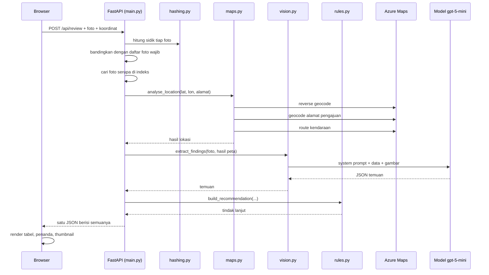
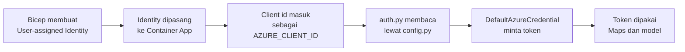

# Trace Alur: Dari Browser sampai Kembali ke Browser

Dokumen ini menelusuri **satu permintaan utuh**, dari pengguna menekan tombol sampai hasil tampil di layar. Setiap langkah menyebut berkas dan fungsi yang mengerjakannya.

Ditujukan untuk orang yang belum pernah melihat kode ini sama sekali. Tidak ada pengetahuan awal yang diandaikan.

- Cara menerapkan: [DEPLOYMENT.md](DEPLOYMENT.md)
- Tujuan produk: [PRD.md](PRD.md)

---

## 1. Cara Membaca Dokumen Ini

Sepanjang dokumen dipakai **satu contoh yang sama**, supaya tidak membingungkan.

| Masukan | Nilai |
|---|---|
| Nomor berkas | `DEMO-006` |
| Koordinat | `-7.6689, 109.6519` |
| Alamat pengajuan | `Jalan Pahlawan, Kebumen` |
| Foto | `tampak-depan.jpg`, `nomor-rumah.jpg` |
| Foto wajib | `tampak-depan`, `nomor-rumah`, `jalan-kiri` |

Perhatikan bahwa `jalan-kiri` **tidak diunggah**. Ini disengaja, agar terlihat bagaimana sistem menangani bukti yang kurang.

### Analogi yang Dipakai

Bayangkan **meja pemeriksaan berkas di kantor**:

| Istilah teknis | Padanan di meja pemeriksaan |
|---|---|
| Permintaan HTTP | Map berkas yang diletakkan di meja |
| Foto | Lembar bukti di dalam map |
| Koordinat | Catatan lokasi di sampul map |
| Model multimodal | Petugas yang melihat dan mendeskripsikan foto |
| Azure Maps | Petugas yang membuka peta dan mengukur jarak |
| Aturan rekomendasi | Buku pedoman di atas meja |
| Managed Identity | Kartu akses petugas untuk membuka lemari arsip |

---

## 2. Peta Berkas

| Berkas | Tanggung jawab |
|---|---|
| `src/app/static/index.html` | Tampilan halaman: formulir dan panel hasil |
| `src/app/static/app.js` | Mengirim formulir, menampilkan hasil |
| `src/app/static/styles.css` | Tampilan visual |
| `src/app/main.py` | Titik masuk API, mengatur urutan seluruh langkah |
| `src/app/config.py` | Membaca konfigurasi dari variabel lingkungan |
| `src/app/auth.py` | Mengambil token Managed Identity |
| `src/app/hashing.py` | Sidik gambar dan pengecilan ukuran |
| `src/app/maps.py` | Semua panggilan ke Azure Maps |
| `src/app/vision.py` | Panggilan ke model multimodal |
| `src/app/prompts/system_prompt.txt` | Instruksi dan skema keluaran untuk model |
| `src/app/rules.py` | Aturan rekomendasi tindak lanjut |
| `src/app/storage.py` | Penyimpanan bukti, saat ini nonaktif |

**Aturan penting:** `main.py` hanya mengatur urutan. Ia tidak memanggil Azure secara langsung. Semua panggilan keluar ada di `maps.py` dan `vision.py`, dan semua token ada di `auth.py`.

---

## 3. Gambaran Alur



---

## 4. Trace Langkah demi Langkah

### Langkah 0 — Pengguna Membuka Halaman

**Berkas:** `src/app/main.py`, fungsi `index()`

```python
@app.get("/")
async def index() -> FileResponse:
    return FileResponse(STATIC_DIR / "index.html")
```

Berkas statis dilayani lewat `app.mount("/static", ...)` pada baris di dekat awal berkas.

> **Yang dihasilkan:** halaman formulir di browser.

---

### Langkah 1 — Pengguna Menekan Tombol Proses

**Berkas:** `src/app/static/app.js`

```js
const response = await fetch("/api/review", {
  method: "POST",
  body: new FormData(form),
});
```

`FormData` mengumpulkan seluruh isian formulir dan berkas foto menjadi satu kiriman `multipart/form-data`.

> **Yang dihasilkan:** satu permintaan HTTP berisi `caseId`, `latitude`, `longitude`, `claimedAddress`, `requiredPhotos`, dan daftar `photos`.

---

### Langkah 2 — Permintaan Diterima

**Berkas:** `src/app/main.py`, fungsi `review()`

```python
@app.post("/api/review")
async def review(
    caseId: str = Form(...),
    latitude: float = Form(...),
    longitude: float = Form(...),
    claimedAddress: str = Form(""),
    requiredPhotos: str = Form(""),
    photos: list[UploadFile] = File(...),
) -> dict:
```

FastAPI memeriksa tipe data secara otomatis. Bila `latitude` bukan angka, permintaan ditolak sebelum kode berjalan.

Tepat setelahnya ada penjaga konfigurasi:

```python
if not settings.ai_endpoint or not settings.ai_deployment:
    raise HTTPException(500, "Endpoint atau deployment model belum dikonfigurasi.")
```

> **Yang dihasilkan:** variabel Python yang siap diolah.

---

### Langkah 3 — Foto Dibaca dan Disidik

**Berkas:** `src/app/main.py` memanggil `src/app/hashing.py`

```python
loaded = [(p.filename or "tanpa-nama", await p.read()) for p in photos]
hashes = [{"file": name, "hash": average_hash(data)} for name, data in loaded]
```

`average_hash()` mengubah gambar menjadi abu-abu, memperkecilnya menjadi 8×8 piksel, lalu menandai tiap piksel lebih terang atau lebih gelap dari rata-rata. Hasilnya 64 bit yang ditulis sebagai teks heksadesimal.

**Mengapa begini:** dua foto yang mirip menghasilkan sidik yang mirip, meski ukuran berkasnya berbeda. Ini yang memungkinkan deteksi foto yang dipakai ulang.

> **Yang dihasilkan:** isi berkas di memori, dan satu sidik per foto.

---

### Langkah 4 — Kelengkapan Bukti Diperiksa

**Berkas:** `src/app/main.py`

```python
required = [line.strip() for line in requiredPhotos.splitlines() if line.strip()]
supplied = {name.lower() for name, _ in loaded}
missing = [r for r in required if not any(r.lower() in s for s in supplied)]
```

Pencocokan dilakukan dengan mencari **potongan nama**. Jadi `tampak-depan` dianggap terpenuhi oleh berkas bernama `tampak-depan.jpg`.

Pada contoh kita, `jalan-kiri` tidak ditemukan.

> **Yang dihasilkan:** `missing = ["jalan-kiri"]`. Ini dipakai dua kali: dikirim ke model sebagai konteks, dan dipakai aturan rekomendasi.

---

### Langkah 5 — Foto Serupa Dicari

**Berkas:** `src/app/main.py`, fungsi `_find_duplicates()`

```python
if hamming(entry["hash"], current["hash"]) <= DUPLICATE_THRESHOLD:
```

`hamming()` di `hashing.py` menghitung berapa bit yang berbeda antara dua sidik. Ambangnya `DUPLICATE_THRESHOLD = 5`, artinya paling banyak 5 bit berbeda dari 64 bit.

Berkas dengan `caseId` yang sama dilewati, supaya foto tidak dibandingkan dengan dirinya sendiri.

> **Catatan penting:** indeks dibaca dari `storage.load_index()`. Karena Blob Storage nonaktif, indeks hanya berada di memori dan **hilang saat aplikasi mati**.

---

### Langkah 6 — Lokasi Dianalisis

**Berkas:** `src/app/maps.py`, fungsi `analyse_location()`

Inilah satu-satunya bagian yang memanggil Azure Maps, dan dilakukan **tiga panggilan**.

#### 6a. Reverse geocode — koordinat menjadi alamat

```python
f"{settings.maps_base_url}/search/address/reverse/json"
params={"api-version": "1.0", "query": f"{lat},{lon}", "returnRoadUse": "true", ...}
```

`returnRoadUse` meminta Azure Maps ikut menyebut jenis jalan terdekat. Nilainya dibandingkan dengan:

```python
MAIN_ROAD_USES = {"LimitedAccess", "Arterial", "Ramp", "Rotary"}
```

Pada contoh kita hasilnya `["Walkway", "Terminal"]`, yang tidak termasuk jalan utama, sehingga `onMainRoad` bernilai `tidak`.

#### 6b. Geocode — alamat pengajuan menjadi koordinat

```python
f"{settings.maps_base_url}/search/address/json"
params={"api-version": "1.0", "query": address, "limit": 1, "countrySet": "ID"}
```

Lalu jarak antara dua titik dihitung dengan `haversine_m()`, yaitu rumus jarak di permukaan bola:

```python
if dist <= settings.address_match_radius_m:          # 150 m
    result["addressMatch"] = "cocok"
elif dist <= settings.address_match_radius_m * 5:    # 750 m
    result["addressMatch"] = "cocok_sebagian"
else:
    result["addressMatch"] = "tidak_cocok"
```

Pada contoh kita jaraknya 238 meter, sehingga hasilnya `cocok_sebagian`.

#### 6c. Route — seberapa dekat mobil bisa mencapai titik itu

**Ini bagian yang paling penting untuk menjawab pertanyaan “masuk gang atau tidak”.**

```python
f"{settings.maps_base_url}/route/directions/json"
params={"query": f"{origin[0]},{origin[1]}:{lat},{lon}", "travelMode": "car", ...}
```

Lalu:

```python
points = routes[0]["legs"][-1]["points"]
last = points[-1]
snap = haversine_m(lat, lon, last["latitude"], last["longitude"])
```

**Cara kerjanya:** mesin rute selalu menarik tujuan ke jalan terdekat yang **bisa dilalui mobil**. Titik akhir rute itu lalu diukur jaraknya ke koordinat rumah sebenarnya.

| Selisih | Artinya |
|---|---|
| Kecil | Rumah berada di jalan yang bisa dilalui mobil |
| Besar | Rumah kemungkinan berada di gang |

Ambangnya `gang_snap_threshold_m`, bernilai 30 meter. Pada contoh kita selisihnya 88 meter, sehingga `carAccessible` bernilai `tidak`.

> **Yang dihasilkan:** satu objek berisi alamat hasil peta, kecocokan alamat, jarak, dan keterjangkauan mobil.

---

### Langkah 7 — Foto Dibaca Model

**Berkas:** `src/app/vision.py`, fungsi `extract_findings()`

Dipanggil dari `main.py` lewat `asyncio.to_thread()` karena pustaka OpenAI bersifat sinkron, sehingga tidak boleh memblokir event loop.

#### 7a. Konteks disusun lebih dulu

```python
context = {
    "alamatPengajuan": claimed_address,
    "hasilPemeriksaanPeta": map_result,
    "daftarFotoWajib": required_photos,
    "fotoWajibBelumAda": missing_photos,
    "namaBerkasTerlampir": [name for name, _ in photos],
}
```

**Perhatikan:** hasil peta dikirim sebagai **fakta masukan**. Model tidak menghitungnya sendiri, dan prompt melarangnya mengubahnya.

#### 7b. Gambar diperkecil lalu disandikan

```python
encoded = base64.b64encode(downscale(data)).decode()
"image_url": {"url": f"data:image/jpeg;base64,{encoded}", "detail": "low"}
```

`downscale()` di `hashing.py` memperkecil sisi terpanjang menjadi 1024 piksel dan menyimpannya sebagai JPEG mutu 80.

**Mengapa:** biaya model mengikuti jumlah token gambar, dan token gambar mengikuti resolusi. `detail: "low"` menekan biaya lebih jauh.

#### 7c. Model dipanggil

```python
completion = _client().chat.completions.create(
    model=settings.ai_deployment,
    messages=[
        {"role": "system", "content": SYSTEM_PROMPT},
        {"role": "user", "content": content},
    ],
    response_format={"type": "json_object"},
)
```

| Bagian | Penjelasan |
|---|---|
| `SYSTEM_PROMPT` | Dibaca dari `prompts/system_prompt.txt` saat modul dimuat |
| `response_format` | Memaksa keluaran berupa JSON |
| Tidak ada `temperature` | Model keluarga GPT-5 menolak nilai selain bawaan |

**Isi utama system prompt:** model hanya boleh mendeskripsikan yang terlihat, wajib menyebut foto sumber, dilarang menyebut ukuran, nilai, sebab kondisi, dan rekomendasi kredit, serta wajib memakai `tidak_dapat_dinilai` bila ragu.

> **Yang dihasilkan:** JSON berisi `buildingFindings`, `evidenceRefs`, `photoQuality`, `observations`, `cannotAssess`, dan `notes`.

---

### Langkah 8 — Rekomendasi Disusun

**Berkas:** `src/app/rules.py`, fungsi `build_recommendation()`

**Ini bukan pekerjaan model.** Rekomendasi dihasilkan aturan yang bisa dibaca dan diaudit manusia.

```python
if needs_visit:
    return {"action": "perlu_kunjungan", "reasons": needs_visit + reasons}
if reasons:
    return {"action": "perlu_bukti_tambahan", "reasons": reasons}
return {"action": "lengkap", ...}
```

| Pemicu | Hasil |
|---|---|
| Alamat tidak cocok | `perlu_kunjungan` |
| Ada foto serupa di berkas lain | `perlu_kunjungan` |
| Cakupan peta terbatas | `perlu_kunjungan` |
| Terlihat papan dijual | `perlu_kunjungan` |
| Foto wajib kurang | `perlu_bukti_tambahan` |
| Lebih dari separuh bidang tidak dapat dinilai | `perlu_bukti_tambahan` |
| Ada foto bermutu buruk | `perlu_bukti_tambahan` |
| Tidak ada penanda | `lengkap` |

Pada contoh kita: `jalan-kiri` hilang, sehingga hasilnya `perlu_bukti_tambahan`.

---

### Langkah 9 — Hasil Dirakit

**Berkas:** `src/app/main.py`

Seluruh potongan digabung menjadi satu objek. Dua ruas terakhir patut diperhatikan:

```python
"creditDecision": None,
"propertyValue": None,
```

**Keduanya sengaja selalu kosong.** Ini batas produk yang ditulis langsung di kode: sistem tidak memutuskan kredit dan tidak menaksir nilai properti.

---

### Langkah 10 — Penyimpanan

**Berkas:** `src/app/storage.py`

```python
saved = all(storage.save_photo(caseId, name, data) for name, data in loaded)
saved = storage.append_index([...]) and saved
saved = storage.save_result(caseId, result) and saved
if not saved:
    result["storageWarning"] = "bukti tidak tersimpan permanen pada percobaan ini"
```

Seluruh fungsi penyimpanan **tidak pernah melempar galat**. Bila gagal, hasil review tetap dikembalikan dan hanya diberi penanda.

**Mengapa begini:** kegagalan menyimpan tidak boleh menggugurkan pekerjaan yang sudah selesai. Prinsip ini juga berlaku pada Azure Maps di Langkah 6.

Pada demo ini Blob Storage nonaktif, sehingga seluruh fungsi mengembalikan keberhasilan dan indeks disimpan di memori.

---

### Langkah 11 — Hasil Ditampilkan

**Berkas:** `src/app/static/app.js`

```js
fillTable(document.getElementById("findings"), data.buildingFindings, data.evidenceRefs);
fillTable(document.getElementById("location"), data.locationFindings);
```

`fillTable()` menerima `evidenceRefs` sebagai argumen ketiga, lalu menambahkan baris kecil di bawah tiap nilai:

```js
ref.textContent = `sumber: ${refs[key].join(", ")}`;
```

**Inilah bagian yang membuat hasilnya dapat dipercaya:** setiap temuan menunjukkan foto asalnya, sehingga petugas bisa memeriksa sendiri.

Penanda dikumpulkan dari tiga sumber:

```js
const flags = [
  ...data.missingEvidence.map(...),
  ...data.integrityFlags.similarPhotoCases.map(...),
  ...(data.photoQuality || []).filter(...).map(...),
];
```

Warna kotak rekomendasi mengikuti nilai `action`, diatur di `styles.css` lewat kelas `.reco.lengkap`, `.reco.perlu_bukti_tambahan`, dan `.reco.perlu_kunjungan`.

---

## 5. Bagaimana Managed Identity Bekerja

Bagian ini penting karena **tidak ada satu pun kunci atau kata sandi di dalam kode**.

### 5.1 Rantainya



### 5.2 Di Infrastruktur

**Berkas:** `infra/resources.bicep`

```bicep
resource identity 'Microsoft.ManagedIdentity/userAssignedIdentities@2023-01-31' = {
  name: '${prefix}-id-${token}'
```

Identitas dipasang ke Container App:

```bicep
identity: {
  type: 'UserAssigned'
  userAssignedIdentities: {
    '${identity.id}': {}
  }
}
```

Lalu client id-nya diteruskan sebagai variabel lingkungan:

```bicep
{ name: 'AZURE_CLIENT_ID', value: identity.properties.clientId }
```

**Mengapa user-assigned, bukan system-assigned:** identitas dibuat lebih dulu, sehingga peran dapat diberikan sebelum sumber daya lain berdiri, dan identitasnya tetap sama saat aplikasi diterapkan ulang.

### 5.3 Di Kode

**Berkas:** `src/app/config.py`

```python
self.managed_identity_client_id = os.getenv("AZURE_CLIENT_ID", "")
```

**Berkas:** `src/app/auth.py`

```python
@lru_cache(maxsize=1)
def get_credential() -> DefaultAzureCredential:
    if settings.managed_identity_client_id:
        return DefaultAzureCredential(
            managed_identity_client_id=settings.managed_identity_client_id
        )
    return DefaultAzureCredential()
```

`lru_cache` membuat kredensial hanya dibuat sekali, sehingga token dapat digunakan ulang.

**Bila dijalankan di komputer sendiri**, `AZURE_CLIENT_ID` kosong, dan `DefaultAzureCredential` otomatis memakai identitas hasil `az login`. Kode tidak perlu diubah.

### 5.4 Dua Scope Berbeda

```python
COGNITIVE_SCOPE = "https://cognitiveservices.azure.com/.default"
MAPS_SCOPE = "https://atlas.microsoft.com/.default"
```

Setiap layanan Azure meminta token dengan sasaran berbeda. Meminta token untuk sasaran yang keliru akan ditolak meski identitasnya benar.

### 5.5 Cara Token Dipakai

**Untuk model**, token disuntikkan lewat penyedia token:

```python
AzureOpenAI(
    azure_endpoint=settings.ai_endpoint,
    azure_ad_token_provider=get_cognitive_token_provider(),
    api_version=settings.ai_api_version,
)
```

Pustaka OpenAI akan meminta token baru sendiri saat yang lama kedaluwarsa.

**Untuk Azure Maps**, header disusun manual:

```python
def _headers() -> dict:
    return {
        "Authorization": f"Bearer {get_maps_token()}",
        "x-ms-client-id": settings.maps_client_id,
    }
```

> **Hal yang mudah terlewat.** Azure Maps memerlukan **dua** hal sekaligus: token pada `Authorization`, dan **client id akun Maps** pada `x-ms-client-id`. Tanpa header kedua, permintaan ditolak meski tokennya sah. Nilainya berasal dari `maps.properties.uniqueId` di Bicep, bukan dari client id identitas.

### 5.6 Peran yang Membuatnya Berfungsi

| Peran | Cakupan | Dipakai pada |
|---|---|---|
| `Cognitive Services OpenAI User` | AI Services | Langkah 7 |
| `Azure Maps Data Reader` | Azure Maps | Langkah 6 |
| `AcrPull` | Container Registry | Saat kontainer dijalankan |

Diberikan di `infra/resources.bicep` sebagai sumber daya `roleAssignments`.

> **Catatan.** Pemberian peran tidak langsung berlaku. Setelah penerapan pertama, panggilan bisa ditolak selama beberapa menit sampai perubahannya menyebar.

---

## 6. Ringkasan Panggilan Keluar

| Layanan | Endpoint | Berkas | Fungsi |
|---|---|---|---|
| Azure Maps | `/search/address/reverse/json` | `maps.py` | `reverse_geocode()` |
| Azure Maps | `/search/address/json` | `maps.py` | `geocode()` |
| Azure Maps | `/route/directions/json` | `maps.py` | `car_snap()` |
| AI Services | `chat/completions` | `vision.py` | `extract_findings()` |

**Hanya empat panggilan keluar per permintaan.** Tidak ada panggilan lain ke luar aplikasi.

---

## 7. Bila Ada yang Gagal

| Kegagalan | Perilaku sistem | Letak penanganan |
|---|---|---|
| Azure Maps gagal | Hasil foto tetap dihasilkan, lokasi ditandai terbatas | `main.py`, blok `try` di Langkah 6 |
| Penyimpanan gagal | Hasil tetap dikembalikan dengan `storageWarning` | `storage.py`, seluruh fungsi |
| Rute tidak ditemukan | `carAccessible` bernilai `tidak_dapat_ditentukan` | `maps.py`, `car_snap()` |
| Alamat tidak ditemukan | `mapCoverageLimited` bernilai benar | `maps.py`, `analyse_location()` |
| Model gagal | Seluruh permintaan gagal | Tidak ditangani, disengaja |
| Konfigurasi model kosong | Ditolak lebih awal dengan pesan jelas | `main.py`, awal `review()` |

**Prinsipnya:** kegagalan pada bagian pendukung tidak boleh menggugurkan seluruh pekerjaan, tetapi kegagalan pada bagian inti harus terlihat jelas.

---

## 8. Menelusuri Sendiri

```powershell
# melihat jalannya permintaan
az containerapp logs show -n <nama-container-app> -g rg-survei-demo --tail 50 --type console

# memeriksa konfigurasi yang terbaca aplikasi
curl.exe -s "<alamat-aplikasi>/api/health"
```

Untuk menelusuri lebih dalam, Application Insights sudah terpasang lewat variabel `APPLICATIONINSIGHTS_CONNECTION_STRING`.

Cara tercepat memahami alur ini adalah membuka halaman demo, mengunggah dua foto, lalu membuka bagian **Keluaran mentah** di bawah panel hasil. Seluruh objek yang dibahas di dokumen ini akan terlihat apa adanya.

---

## 9. Yang Perlu Diketahui Sebelum Mengubah Kode

| Hal | Sebabnya |
|---|---|
| Jangan menambah `temperature` pada panggilan model | Model keluarga GPT-5 menolaknya |
| Jangan memindahkan rekomendasi ke model | Harus tetap berupa aturan yang dapat diaudit |
| Jangan mengisi `creditDecision` atau `propertyValue` | Batas produk yang disengaja |
| Jangan memakai EXIF sebagai sumber koordinat tepercaya | Mudah disunting dan kerap terhapus |
| Jangan menyimpulkan susunan jalan dari foto | Hanya peta dan protokol perekaman yang bisa menjawabnya |
| Jangan menambah bidang tanpa opsi `tidak_dapat_dinilai` | Memaksa model menebak |
